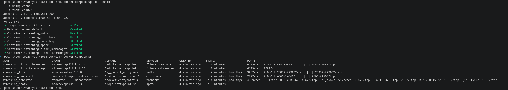
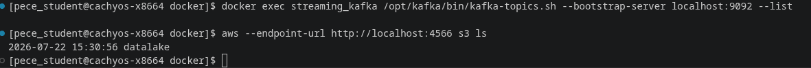
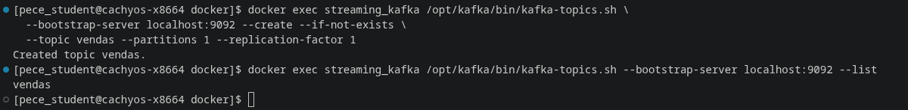
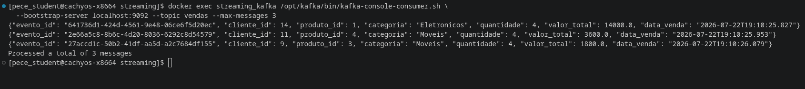
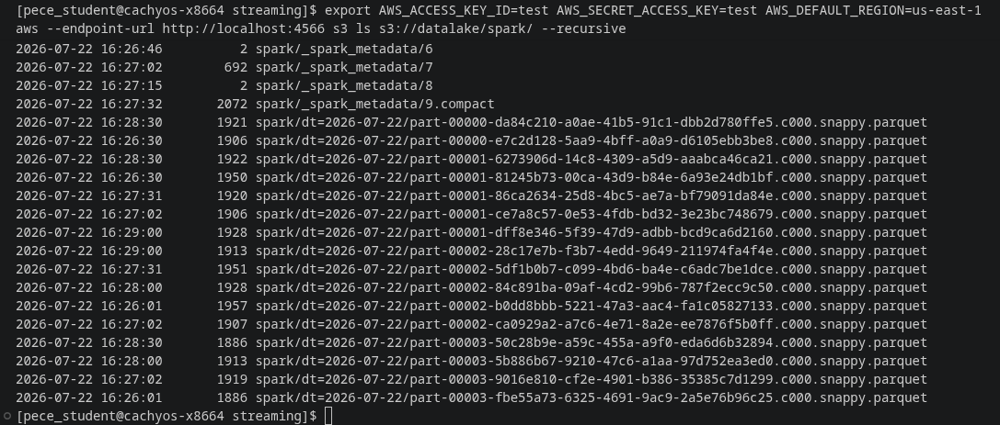
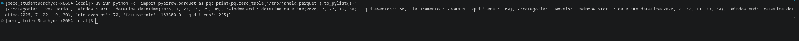

# Tutorial 3 — Streaming com Kafka + Spark (janela de 30s)

Pipeline de streaming que lê **eventos de venda** de um tópico **Kafka**, agrega em
**janelas de 30 segundos por categoria** (event-time + watermark) com **Spark Structured
Streaming** e grava o resultado em **Parquet** num data lake S3 local (MiniStack).

> As imagens referenciadas neste README ficam na pasta `images/` (ao lado deste arquivo).

---

## 1. Objetivos

- Publicar um fluxo contínuo de eventos de venda em um tópico Kafka (`vendas`) com um producer Python.
- Consumir esse fluxo com Spark Structured Streaming, agregando por **(janela de 30s, categoria)**:
  contagem de eventos, faturamento e quantidade de itens.
- Ancorar a agregação no **event-time** (`data_venda`) usando **watermark** de 10s.
- Materializar o resultado em **Parquet** no S3 (`s3a://datalake/spark/`), particionado por data (`dt`).

---

## 2. Arquitetura

```
  producer.py (host)            Kafka                Spark (container)             MiniStack (S3)
  gera eventos de venda ─publica─► tópico ─consome─► readStream.format(kafka) ──► s3://datalake/
  ~8/s em JSON           :29092    "vendas"   :9092   janela 30s por categoria      spark/dt=.../
                                                      writeStream Parquet           *.parquet
```

Pontos-chave da arquitetura:

- **Duas portas para o mesmo Kafka.** Do **host**, o broker responde em `localhost:29092`
  (usado pelo producer). De **dentro do Docker**, os containers alcançam o broker em `kafka:9092`
  (usado pelo consumer Spark). É o mesmo Kafka, dois endereços.
- **Event-time, não processing-time.** A janela é ancorada no campo `data_venda` (quando a venda
  ocorreu), não no momento em que o Spark leu a mensagem — garantindo resultado determinístico e
  reprodutível.
- **`append` + `watermark` + sink de arquivo.** O watermark de 10s permite ao Spark declarar uma
  janela "fechada" e gravá-la **uma única vez** em Parquet (arquivos são imutáveis).
- **Checkpoint local.** Offsets do Kafka + estado das janelas ficam em `/work/checkpoint_spark`
  (disco do container), não no S3, pois o protocolo de checkpoint depende de `rename` atômico.

---

## 3. Pré-requisitos

- Docker + Docker Compose (com o daemon rodando e o usuário no grupo `docker`).
- Python 3.12 e [`uv`](https://docs.astral.sh/uv/) para o ambiente do producer.
- AWS CLI v2 (para inspecionar o S3 do MiniStack).

> A infraestrutura (Kafka, Spark, MiniStack) vem do tutorial `1-infraestrutura/local`, que é
> **pré-requisito** deste projeto.

---

## 4. Passo a passo

### 4.1 Subir a infraestrutura

```bash
cd tutoriais/streaming/1-infraestrutura/local/docker
docker compose up -d --build
docker compose ps        # kafka/ministack/rabbitmq (healthy); spark/flink (Up)
```



Aponte o AWS CLI para o MiniStack (S3 local — credenciais fictícias `test`):

```bash
export AWS_ACCESS_KEY_ID=test
export AWS_SECRET_ACCESS_KEY=test
export AWS_DEFAULT_REGION=us-east-1
export AWS_REQUEST_CHECKSUM_CALCULATION=when_required   # MiniStack não aceita CRC64NVME
```



### 4.2 Criar o tópico `vendas`

```bash
docker exec streaming_kafka /opt/kafka/bin/kafka-topics.sh \
  --bootstrap-server localhost:9092 --create --if-not-exists \
  --topic vendas --partitions 1 --replication-factor 1
```



### 4.3 Rodar o producer (fonte de dados)

Na pasta deste tutorial (`3-kafka-spark/local`), com ambiente gerenciado por `uv`:

```bash
uv run producer.py 8        # 8 eventos/s — deixe rodando
```


Validação independente do Spark (em outro terminal): ler direto do tópico.

```bash
docker exec streaming_kafka /opt/kafka/bin/kafka-console-consumer.sh \
  --bootstrap-server localhost:9092 --topic vendas --max-messages 3
```



### 4.4 Rodar o consumer Spark (processador)

O `consumer_spark.py` fica em `1-infraestrutura/local/docker/work/` (montado como `/work` no
container). Submeta o job:

```bash
docker exec -it streaming_spark /opt/spark/bin/spark-submit \
  --conf spark.jars.ivy=/tmp/.ivy2 \
  --packages org.apache.spark:spark-sql-kafka-0-10_2.12:3.5.3,org.apache.hadoop:hadoop-aws:3.3.4 \
  --conf spark.hadoop.fs.s3a.endpoint=http://ministack:4566 \
  --conf spark.hadoop.fs.s3a.access.key=test \
  --conf spark.hadoop.fs.s3a.secret.key=test \
  --conf spark.hadoop.fs.s3a.path.style.access=true \
  --conf spark.hadoop.fs.s3a.connection.ssl.enabled=false \
  --conf spark.hadoop.fs.s3a.aws.credentials.provider=org.apache.hadoop.fs.s3a.SimpleAWSCredentialsProvider \
  /work/consumer_spark.py
```

> A 1ª execução baixa `hadoop-aws` + `aws-java-sdk-bundle` (~200 MB) e fica cacheada em
> `/tmp/.ivy2`. O terminal "trava" mostrando logs a cada ~15s: isso é a query rodando **viva**.

### 4.5 Verificar o resultado no S3

Após ~40–60s (janela de 30s + watermark de 10s), os primeiros arquivos aparecem:

```bash
aws --endpoint-url http://localhost:4566 s3 ls s3://datalake/spark/ --recursive
# -> spark/dt=YYYY-MM-DD/part-*.snappy.parquet
```



Ler o conteúdo de uma janela agregada:

```bash
uv add pyarrow   # se ainda não tiver
FILE=$(aws --endpoint-url http://localhost:4566 s3 ls s3://datalake/spark/dt=$(date -u +%F)/ | awk '{print $4}' | head -1)
aws --endpoint-url http://localhost:4566 s3 cp "s3://datalake/spark/dt=$(date -u +%F)/$FILE" /tmp/janela.parquet
uv run python -c "import pyarrow.parquet as pq; print(pq.read_table('/tmp/janela.parquet').to_pylist())"
# -> [{'categoria':'Alimentos','window_start':..,'window_end':..,'qtd_eventos':72,'faturamento':4550.0,'qtd_itens':218}, ...]
```



---

## 5. Parar e reprocessar

```bash
# parar: Ctrl+C no spark-submit e depois no producer
cd tutoriais/streaming/1-infraestrutura/local/docker
docker compose stop        # pausa tudo (restart rápido)
# docker compose down -v   # remove tudo (recria limpo)
```

Para reprocessar do zero (esquecer os offsets já lidos), apague o checkpoint:

```bash
docker exec -u root streaming_spark rm -rf /work/checkpoint_spark
```

---

## 6. Troubleshooting (problemas encontrados neste projeto)

| Sintoma | Causa | Solução |
|---|---|---|
| `permission denied ... docker.sock` | usuário fora do grupo `docker` | `sudo usermod -aG docker $USER` + nova sessão (relogin/reboot) |
| `FileNotFoundException .../.ivy2/cache/resolved-*.xml` | pasta do Ivy inexistente/sem permissão | criar como root e liberar: `docker exec -u root streaming_spark sh -c "mkdir -p /tmp/.ivy2/{cache,jars} && chmod -R 777 /tmp/.ivy2"` |
| `IOException: mkdir of file:/work/checkpoint_spark failed` | `/work` sem permissão para o usuário não-root do Spark | `docker exec -u root streaming_spark sh -c "mkdir -p /work/checkpoint_spark && chmod -R 777 /work"` |
| Producer: `Connection refused` a `29092` | Kafka fora do ar ou porta errada | subir o tutorial 1; publicar em `29092` (host) |
| Consumer não lê nada | `startingOffsets=latest` + producer parado | deixar o producer rodando |
| Nada aparece no S3 | nenhuma janela fechou ainda | aguardar > 40s com o producer ativo |